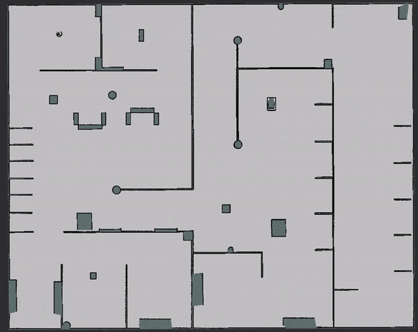
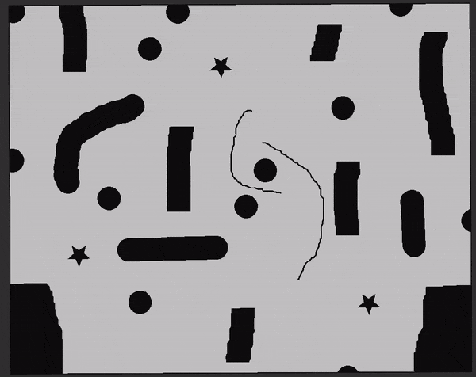

# RRT*

This project is a ROS-based implementation of [Quick-RRT*](https://www.sciencedirect.com/science/article/abs/pii/S0957417419300326) (proposed by Jeong et al.), a modified version of the well-known RRT* path planning algorithm. Compared to RRT*, Quick-RRT* generates a better initial solution by considering the concept of ancestry.

This implementation supports both point-to-point planning and planning for differential drive robots (a templated base class is used to avoid copying-pasting a lot of code).

## Build

To build this project, the *tf2-geometry-msgs* package is needed. It can be installed through:

`sudo apt install ros-${ROS_DISTRO}-tf2-geometry-msgs`.

Then you can simply clone this repository in your ROS workspace and build it through `catkin_make`.

To launch the demo, the *map server* is needed:

`sudo apt install ros-${ROS_DISTRO}-map-server`.

## Demo

* Launch the demo through: 
  `roslaunch rrt rrt_demo.launch`. 
  Then you can use the built-in rviz buttons `2D Pose Estimate` and `2D Nav Goal` to select starting point and goal, respectively. Please note that the orientation of start and goal will not be considered if point-to-point planning is performed. Path planning starts automatically once start and goal are set. The resulting path and the explored tree will be displayed on rviz.
* To load a different map, you can simply put the desired map inside the `maps/` folder and pass its name as argument of the roslaunch command: 
  `roslaunch rrt rrt_demo.launch map_name:=dummy_map`
* To switch between path planning for differential drive robots and point-to-point planning, you can change the value of `differential_drive` in the config file `config/params.yaml`. You can also play around with the other parameters!

### Examples

---

**Point-to-point planning**

**Planning with Dubins paths**

