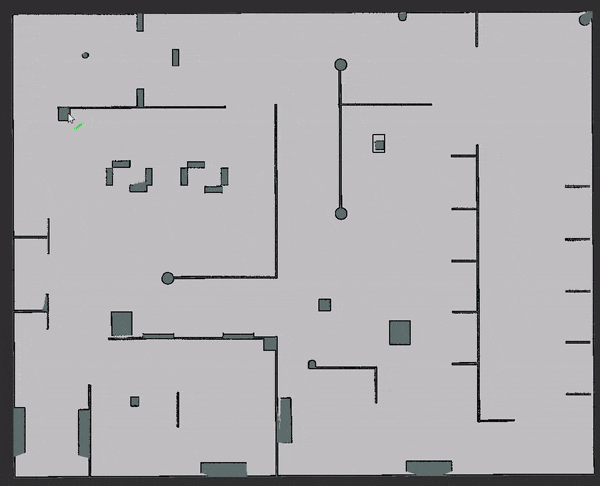
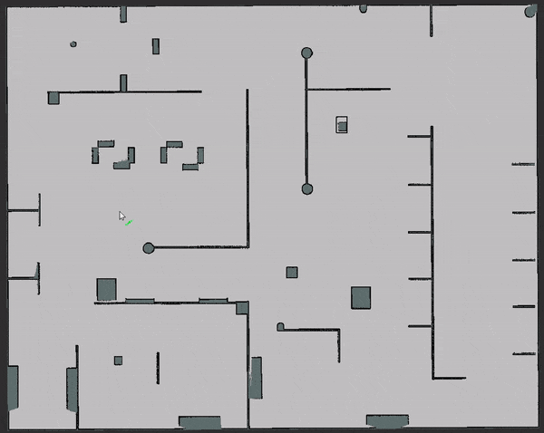
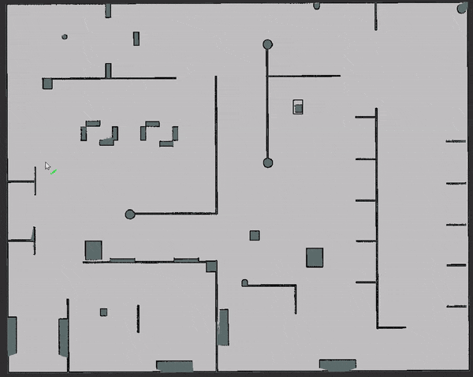

# RRT*

This project is a ROS-based implementation of [Quick-RRT*](https://www.sciencedirect.com/science/article/abs/pii/S0957417419300326) (proposed by Jeong et al.), a modified version of the well-known RRT* path planning algorithm. Compared to RRT*, Quick-RRT* generates a better initial solution by considering the concept of ancestry.

This implementation performs path planning for differential drive robots. Paths between points can be computed through different algorithms. The desired algorithm can be selected by simply editing the `config/params.yaml` file (the currently supported algorithms are: dubins path generation, [POSQ extend function](http://www.spencer.eu/papers/palmieriICAPS14.pdf) and cubic spline interpolation).

Tested on Ubuntu 18.04 (ROS melodic) and Ubuntu 20.04 (ROS noetic).

## Build

To build this project, the *tf2-geometry-msgs* package is needed. It can be installed through:

`sudo apt install ros-${ROS_DISTRO}-tf2-geometry-msgs`.

Then you can simply clone this repository in your ROS workspace and build it through `catkin_make`.

To launch the demo, the *map server* and *rviz* are needed:

`sudo apt install ros-${ROS_DISTRO}-map-server ros-${ROS_DISTRO}-rviz`.

## Demo

* Launch the demo through: 
  `roslaunch rrt rrt_demo.launch`. 
  Then you can use the built-in rviz buttons `2D Pose Estimate` and `2D Nav Goal` to select starting point and goal, respectively. Path planning starts automatically once start and goal are set. The resulting path and the explored tree will be displayed on rviz.
* To load a different map, you can simply put the desired map inside the `maps/` folder and pass its name as argument of the roslaunch command: 
  `roslaunch rrt rrt_demo.launch map_name:=dummy_map`
* You can play around with the most relevant parameters by simply editing the config file `config/params.yaml`!

### Examples

---

**Dubins paths**

**POSQ extend function**

**Cubic spline interpolation**

## Future works

- Here, the main role of ROS is to provide a graphical interface to easily set the start and goal for the path planning algorithm. Since the RRT* search implementation is almost independent of ROS, it will likely be moved to a different standalone and ROS-independent library.
- More algorithms for paths computation!
